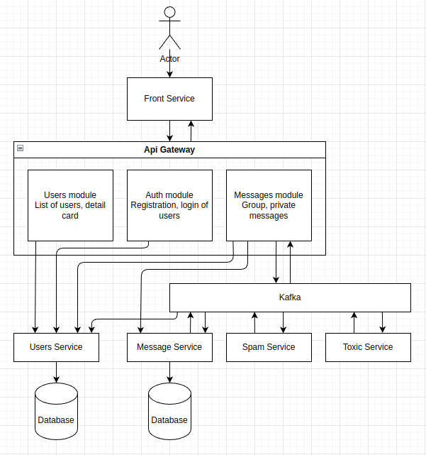
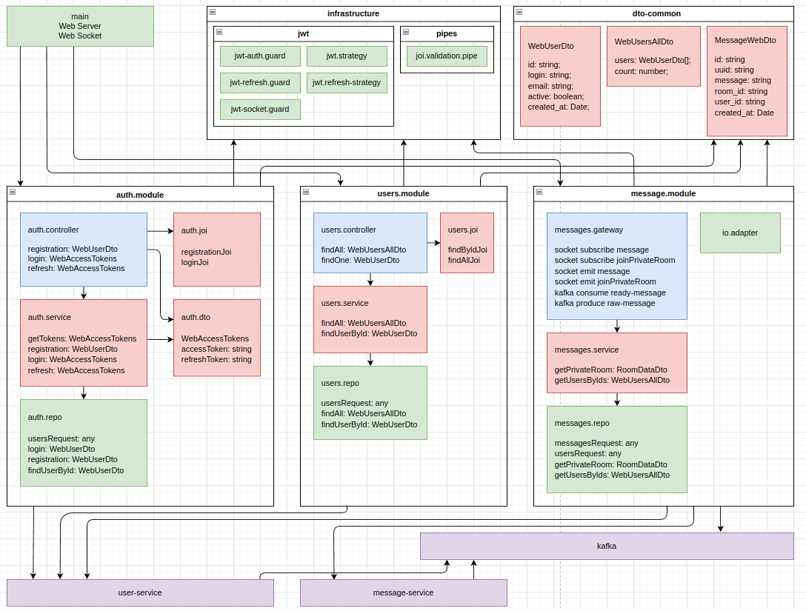

## Api Gateway

Api gateway is the pattern of distributed systems which provides a single entry point for backend application. Api gateway provides different features:
 - Adapter for backend functionality
 - Authorization and validation
 - Load balancer
 - Caching
 - Logging

Full code - [link](https://github.com/Igorok/micro-api-gateway)

### Whole scheme:



Short description:

- User opens the front-end application in the browser.
- User wants to register a new account. Front-end service sends a http request to the api gateway. Api gateway sends a http request to the user service, and provides a response to the front-end service.
- User wants to login in the application. Front-end service sends a http request to the api gateway. Api gateway sends a http request with login and password to the user service. After successful response the api gateway generates two JWT tokens, first to verify the user and second for updating the main token every few minutes. After these actions the api gateway gives a response containing two tokens to the front-end service.
- User wants to see a list of other users. Front-end service sends a http request to the api gateway. Api gateway requests data from the user service, and provides a response to the front-end service.
- User opens the chat room for messaging. Front-end service emits an event to the api gateway through socket.io. Api gateway requests data from message service about a chat room, and data about users from the users service, and provides data to the front-end service.
- User sends a message, front-end service emits a message through socket.io. Api gateway emits messages in the Kafka topic for new messages.
- Message service subscribes to the topic with new messages, saves them and publishes events into the topic for saved messages.
- Users in the front-end service receive messages in the browser from the Api gateway.
- Spam service subscribes to the Kafka topic with saved messages. Scikit-learn
model analyzes messages. Messages which were predicted as spam do publish into the Kafka topic for analyzed messages.
- Toxic service subscribes to the Kafka topic with saved messages. Tensorflow model analyzes messages. Messages which were predicted as toxic do publish into the Kafka topic for analyzed messages.
- Message and User services listen to events with spam and toxic messages, mark them in the database, and apply domain logic after receiving these events.

### Scheme of the api gateway:



`src/main.ts` - initialization of the service. I use `swagger` as documentation and REST client for testing of http requests.

```typescript
import * as basicAuth from 'express-basic-auth';
import { NestFactory } from '@nestjs/core';
import { ConfigService } from '@nestjs/config';
import { SwaggerModule, DocumentBuilder } from '@nestjs/swagger';
import { AppModule } from './app.module';
import { SocketIoAdapter } from 'src/modules/messages/io.adapter';

async function bootstrap() {
  const app = await NestFactory.create(AppModule, {
    cors: true,
  });
  const configService: ConfigService = app.get(ConfigService);

  app.useWebSocketAdapter(new SocketIoAdapter(app, configService));

  app.use(
    ['/swagger'],
    basicAuth({
      challenge: true,
      users: {
        [configService.get<string>('DOC_USER')]:
          configService.get<string>('DOC_PASS'),
      },
    }),
  );

  const swaggerConfig = new DocumentBuilder()
    .setTitle('Api Gateway')
    .setVersion('0.0.1')
    .addBearerAuth(
      { type: 'http', scheme: 'bearer', bearerFormat: 'JWT' },
      'JWT',
    )
    .build();

  const document = SwaggerModule.createDocument(app, swaggerConfig);

  SwaggerModule.setup('swagger', app, document, {
    swaggerOptions: {
      persistAuthorization: true,
    },
  });

  await app.listen(configService.get<string>('APP_PORT'));
}
bootstrap();
```

`src/app.module.ts` - describes modules of service. There are few modules here:

- ConfigModule - nest.js module, provides functionality for configuration
- AuthModule - provides functionality for registration, authentication and authorization
- UsersModule - provides data and functionality for interface of users
- MessagesModule - provides data and functionality for interface of chat rooms and messages

```typescript
import { Module } from '@nestjs/common';
import { ConfigModule } from '@nestjs/config';
import { AppController } from './app.controller';
import { AppService } from './app.service';
import { AuthModule } from 'src/modules/auth/auth.module';
import { UsersModule } from 'src/modules/users/users.module';
import { MessagesModule } from 'src/modules/messages/messages.module';

@Module({
  imports: [
    ConfigModule.forRoot({
      envFilePath: [
        __dirname + '/../config/.env.prod',
        __dirname + '/../config/.env.dev',
      ],
      isGlobal: true,
    }),
    AuthModule,
    UsersModule,
    MessagesModule,
  ],
  controllers: [AppController],
  providers: [AppService],
})
export class AppModule {}
```

### Auth module

`src/modules/auth/auth.module.ts` - describes module.

Imports - list of classes which this module required.

- `PassportModule` - authentication library.
- `JwtModule` - library for JWT token.
- `HttpModule` - axios http library.

Provides - classes which provide data and functionality for the module. These classes are injected into the module, and for testing possible to replace them.

- `AuthService` - provides application logic for the module.
- `AuthRepo` - provides functionality for data management, for the module.
- `JwtStrategy` - provides functionality for verification of the JWT token.
- `RefreshTokenStrategy` - provides functionality for refreshing of the JWT token.

Controllers - list of controllers.

- `AuthController` - provides REST API for the module.

```typescript
import { JwtModule } from '@nestjs/jwt';
import { Module } from '@nestjs/common';
import { HttpModule } from '@nestjs/axios';
import { PassportModule } from '@nestjs/passport';
import { ConfigModule, ConfigService } from '@nestjs/config';
import { AuthRepo } from './auth.repo';
import { AuthService } from './auth.service';
import { AuthController } from './auth.controller';
import { JwtStrategy } from 'src/infrastructure/jwt/strategy/jwt.strategy';
import { RefreshTokenStrategy } from 'src/infrastructure/jwt/strategy/jwt.refresh-strategy';

@Module({
  imports: [
    PassportModule,
    JwtModule.registerAsync({
      imports: [ConfigModule],
      inject: [ConfigService],
      useFactory: async (configService: ConfigService) => ({
        secret: configService.get<string>('JWT_SECRET'),
        signOptions: {
          expiresIn: configService.get<string>('JWT_EXPIRES'),
        },
      }),
    }),
    HttpModule,
  ],
  providers: [AuthService, AuthRepo, JwtStrategy, RefreshTokenStrategy],
  controllers: [AuthController],
})
export class AuthModule {}
```

`src/modules/auth/auth.controller.ts` - provides REST API for registration and authorization.

Methods:

- `/registration` - provides registration of new users in the application.
- `/login` - provides login in the application
- `/refresh` - provides updating of the JWT token.


```typescript
import {
  Controller,
  Request,
  Post,
  UseGuards,
  UsePipes,
  Body,
  BadRequestException,
  HttpStatus,
} from '@nestjs/common';
import {
  ApiTags,
  ApiOperation,
  ApiResponse,
  ApiBearerAuth,
} from '@nestjs/swagger';
import { AuthService } from './auth.service';
import { JoiValidationPipe } from 'src/infrastructure/pipes/joi.validation.pipe';
import { registrationJoi, loginJoi } from './auth.joi';
import {
  WebLoginParamDto,
  WebUserDto,
  WebRegistrationParamDto,
} from 'micro-dto';
import { RefreshTokenGuard } from 'src/infrastructure/jwt/guard/jwt-refresh.guard';
import { WebAccessTokens } from './auth.dto';

@Controller('auth')
export class AuthController {
  constructor(private authService: AuthService) {}

  @Post('/registration')
  @ApiTags('Authorization')
  @ApiOperation({ summary: 'Registration of new user' })
  @ApiResponse({
    status: HttpStatus.OK,
    description: 'Success',
    type: WebUserDto,
  })
  @UsePipes(new JoiValidationPipe(registrationJoi))
  async registration(
    @Body() body: WebRegistrationParamDto,
  ): Promise<WebUserDto> {
    try {
      return await this.authService.registration(body);
    } catch (error) {
      if (error?.code === 11000) {
        throw new BadRequestException('Duplicate user', {
          cause: error,
          description: 'User with same login or email already exists',
        });
      }

      throw new BadRequestException(error.message, {
        cause: error,
        description: error.message,
      });
    }
  }

  @Post('/login')
  @ApiTags('Authorization')
  @ApiOperation({ summary: 'Login in application' })
  @UsePipes(new JoiValidationPipe(loginJoi))
  async login(@Body() body: WebLoginParamDto): Promise<WebAccessTokens> {
    return this.authService.login(body);
  }

  @Post('/refresh')
  @UseGuards(RefreshTokenGuard)
  @ApiTags('Authorization')
  @ApiOperation({ summary: 'Refresh of JWT token' })
  @ApiBearerAuth('JWT')
  async refresh(@Request() req): Promise<WebAccessTokens> {
    return this.authService.refresh(req.user);
  }
}
```

`src/modules/auth/auth.service.ts` - provides application logic for the authentication.

Methods:

- `getTokens` - method provides generation JWT tokens
- `registration` - method provides registration new user in the users service
- `login` - method provides a users login in the users service, and returns two JWT tokens
- `refresh` - method requests a users data from users service, after success response returns updated tokens

```typescript
import { JwtService } from '@nestjs/jwt';
import { ConfigService } from '@nestjs/config';
import { Injectable, UnauthorizedException } from '@nestjs/common';
import {
  WebRegistrationParamDto,
  WebLoginParamDto,
  WebUserDto,
} from 'micro-dto';
import { AuthRepo } from './auth.repo';
import { WebAccessTokens } from './auth.dto';

@Injectable()
export class AuthService {
  constructor(
    private configService: ConfigService,
    private jwtService: JwtService,
    private authRepo: AuthRepo,
  ) {}

  // method provides generation JWT tokens
  private async getTokens(user: WebUserDto): Promise<WebAccessTokens> {
    const { id, login, email, active, created_at } = user;
    const [accessToken, refreshToken] = await Promise.all([
      this.jwtService.signAsync(
        { id, login, email, active, created_at },
        {
          secret: this.configService.get<string>('JWT_SECRET'),
          expiresIn: this.configService.get<string>('JWT_EXPIRES'),
        },
      ),
      this.jwtService.signAsync(
        { id, login, email, active, created_at },
        {
          secret: this.configService.get<string>('JWT_REFRESH_SECRET'),
          expiresIn: this.configService.get<string>('JWT_REFRESH_EXPIRES'),
        },
      ),
    ]);

    return {
      accessToken,
      refreshToken,
    };
  }

  // method provides registration new user in the users service
  async registration(
    registrationDto: WebRegistrationParamDto,
  ): Promise<WebUserDto> {
    const { id, login, email, active, created_at } =
      await this.authRepo.registration(registrationDto);
    return { id, login, email, active, created_at };
  }

  // method provides a users login in the users service, and returns two JWT tokens
  async login(loginDto: WebLoginParamDto): Promise<WebAccessTokens> {
    const user = await this.authRepo.login(loginDto);

    const { id, login, email, active, created_at } = user;
    const { accessToken, refreshToken } = await this.getTokens({
      id,
      login,
      email,
      active,
      created_at,
    });

    return { accessToken, refreshToken };
  }

  // method requests a users data from users service, after success response returns updated tokens
  async refresh(user: WebUserDto): Promise<WebAccessTokens> {
    if (!user?.id) {
      throw new UnauthorizedException();
    }

    const activeUser = await this.authRepo.findUserById({
      id: user.id,
    });

    if (!activeUser) {
      throw new UnauthorizedException();
    }

    const { id, login, email, active, created_at } = activeUser;
    const { accessToken, refreshToken } = await this.getTokens({
      id,
      login,
      email,
      active,
      created_at,
    });

    return { accessToken, refreshToken };
  }
}
```

`src/modules/auth/auth.repo.ts` - provides data management for the auth service

Methods:

- `usersRequest` - method provides communication with user service through http requests
- `login` - method provides login in the users service and receiving data about user
- `registration` - method provides creation new users in the user service and receiving data about user
- `findUserById` - method provides receiving data about user

```typescript
import { HttpService } from '@nestjs/axios';
import {
  BadRequestException,
  Injectable,
  InternalServerErrorException,
} from '@nestjs/common';
import { ConfigService } from '@nestjs/config';
import {
  FindByIdDto,
  WebLoginParamDto,
  WebRegistrationParamDto,
  WebUserDto,
} from 'micro-dto';

@Injectable()
export class AuthRepo {
  constructor(
    private configService: ConfigService,
    private readonly httpService: HttpService,
  ) {}

  errorMessage: string = 'Oops something went wrong';

  // method provides communication with user service through http requests
  private async usersRequest(method: string, url: string, param?: any) {
    try {
      const uri = `${this.configService.get<string>('API_USERS')}${url}`;
      const response = await this.httpService.axiosRef?.[method](uri, param);
      return response.data;
    } catch (error) {
      if (error.response?.data?.statusCode === 400) {
        throw new BadRequestException(error.response.data.message);
      }
      throw new InternalServerErrorException(
        error.response?.data?.message || this.errorMessage,
      );
    }
  }

  // method provides login in the users service and receiving data about user
  async login(param: WebLoginParamDto): Promise<WebUserDto> {
    return await this.usersRequest('post', '/users/login', param);
  }

  // method provides creation new users in the user service and receiving data about user
  async registration(param: WebRegistrationParamDto): Promise<WebUserDto> {
    return await this.usersRequest('post', '/users/registration', param);
  }

  // method provides receiving data about user
  async findUserById(param: FindByIdDto): Promise<WebUserDto> {
    return await this.usersRequest('get', `/users/find-one/${param.id}`);
  }
}
```

`src/modules/auth/auth.joi.ts` - provides validation for REST API

```typescript
import * as Joi from 'joi';

export const registrationJoi = Joi.object({
  login: Joi.string().max(100).required(),
  email: Joi.string().max(100).required().email(),
  password: Joi.string().max(100).required(),
  passwordRepeat: Joi.ref('password'),
}).with('password', 'passwordRepeat');

export const loginJoi = Joi.object({
  login: Joi.string().max(100).required(),
  password: Joi.string().max(100).required(),
});
```

### Users module

`src/modules/users/users.module.ts` - describes module.

Imports - list of classes which this module required.

 - `HttpModule` - axios http library.

Provides - classes which provide data and functionality for the module. These classes are injected into the module, and for testing possible to replace them.

 - `UsersService` - provides application logic for the module.
 - `UsersRepo` - provides functionality for data management, for the module.

Controllers - list of controllers.

- `UsersController` - provides REST API for the module.

```typescript
import { Module } from '@nestjs/common';
import { HttpModule } from '@nestjs/axios';
import { UsersService } from 'src/modules/users/users.service';
import { UsersController } from 'src/modules/users/users.controller';
import { UsersRepo } from './users.repo';

@Module({
  imports: [
    HttpModule,
  ],
  providers: [UsersService, UsersRepo],
  controllers: [UsersController],
})
export class UsersModule {}
```

`src/modules/users/users.controller.ts` - provides REST API for the module.

Methods:

- `/find-all` - provides the list of users
- `/find-one/:id` - provides detail information about user

```typescript
import {
  ApiBearerAuth,
  ApiOperation,
  ApiResponse,
  ApiTags,
} from '@nestjs/swagger';
import {
  Controller,
  Get,
  HttpStatus,
  Param,
  Query,
  UseGuards,
  UsePipes,
  Request,
} from '@nestjs/common';
import { JoiValidationPipe } from 'src/infrastructure/pipes/joi.validation.pipe';
import {
  FindAllDto,
  FindByIdDto,
  WebUserDto,
  WebUsersAllDto,
} from 'micro-dto';
import { findByIdJoi, findAllJoi } from './users.joi';
import { UsersService } from './users.service';
import { JwtAuthGuard } from 'src/infrastructure/jwt/guard/jwt-auth.guard';

@Controller('users')
export class UsersController {
  constructor(private usersService: UsersService) {}

  @Get('/find-all')
  @ApiTags('Users')
  @ApiOperation({ summary: 'List of users' })
  @ApiBearerAuth('JWT')
  @ApiResponse({
    status: HttpStatus.OK,
    description: 'Success',
    type: WebUsersAllDto,
  })
  @UseGuards(JwtAuthGuard)
  @UsePipes(new JoiValidationPipe(findAllJoi))
  findAll(
    @Query() params: FindAllDto,
    @Request() req,
  ): Promise<WebUsersAllDto> {
    return this.usersService.findAll(params, req.user);
  }

  @Get('/find-one/:id')
  @UseGuards(JwtAuthGuard)
  @UsePipes(new JoiValidationPipe(findByIdJoi))
  @ApiTags('Users')
  @ApiOperation({ summary: 'Get user by id' })
  @ApiBearerAuth('JWT')
  @ApiResponse({
    status: HttpStatus.OK,
    description: 'Success',
    type: WebUserDto,
  })
  findOne(@Param() params: FindByIdDto): Promise<WebUserDto> {
    return this.usersService.findUserById(params);
  }
}
```

`src/modules/users/users.service.ts` - provides application logic for the module.

Methods:

- `findAll` - provides the list of users
- `findUserById` - provides detail information about user

```typescript
import { Injectable } from '@nestjs/common';
import {
  FindAllDto,
  FindByIdDto,
  WebUserDto,
  WebUsersAllDto,
} from 'micro-dto';
import { UsersRepo } from './users.repo';

@Injectable()
export class UsersService {
  constructor(private usersRepo: UsersRepo) {}

  // provides the list of users
  async findAll(param: FindAllDto, user: WebUserDto): Promise<WebUsersAllDto> {
    param.excludeIds = [user.id];
    return this.usersRepo.findAll(param);
  }

  // provides detail information about user
  async findUserById(param: FindByIdDto): Promise<WebUserDto> {
    const { id, login, email, active, created_at } =
      await this.usersRepo.findUserById(param);
    return { id, login, email, active, created_at };
  }
}
```

`src/modules/users/users.repo.ts` - provides functionality for data management, for the module.

Methods:

- `usersRequest` - provides communication with user service through http requests
- `findAll` - provides receiving users list data from the users service
- `findUserById` - provides receiving user detail data from the users service

```typescript
import { HttpService } from '@nestjs/axios';
import {
  BadRequestException,
  Injectable,
  InternalServerErrorException,
} from '@nestjs/common';
import { ConfigService } from '@nestjs/config';
import {
  FindAllDto,
  FindByIdDto,
  WebUserDto,
  WebUsersAllDto,
} from 'micro-dto';

@Injectable()
export class UsersRepo {
  constructor(
    private configService: ConfigService,
    private readonly httpService: HttpService,
  ) {}

  errorMessage: string = 'Oops something went wrong';

  // provides communication with user service through http requests
  async usersRequest(method: string, url: string, param?: any) {
    try {
      const uri = `${this.configService.get<string>('API_USERS')}${url}`;
      const response = await this.httpService.axiosRef?.[method](uri, param);
      return response.data;
    } catch (error) {
      if (error.response?.data?.statusCode === 400) {
        throw new BadRequestException(error.response.data.message);
      }
      throw new InternalServerErrorException(
        error.response?.data?.message || this.errorMessage,
      );
    }
  }

  // provides receiving users list data from the users service
  async findAll(param: FindAllDto): Promise<WebUsersAllDto> {
    const searchParam = new URLSearchParams(
      Object.entries(param).map((p) => p),
    );
    let url = `/users/find-all?${searchParam.toString()}`;
    return await this.usersRequest('get', url);
  }

  // provides receiving user detail data from the users service
  async findUserById(param: FindByIdDto): Promise<WebUserDto> {
    return await this.usersRequest('get', `/users/find-one/${param.id}`);
  }
}
```

`src/modules/users/users.joi.ts` - provides validation for the REST API

```typescript
import * as Joi from 'joi';

export const findByIdJoi = Joi.object({
  id: Joi.string().length(24).required(),
});

export const findAllJoi = Joi.object({
  excludeIds: Joi.alternatives().try(
    Joi.array().items(Joi.string()),
    Joi.string(),
  ),
  login: Joi.string().min(3).max(100),
  skip: Joi.number().min(0),
  limit: Joi.number().min(1).max(100),
  sortField: Joi.string().valid(...['id', 'login']),
  sortAsc: Joi.string().valid(...['asc', 'desc']),
});
```

### Messages module

`src/modules/messages/messages.module.ts` - describes module.

Imports - list of classes which this module required.

- `HttpModule` - axios http library.

Provides - classes which provide data and functionality for the module. These classes are injected into the module, and for testing possible to replace them.

- `MessagesGateway` - provides functionality for subscription and emitting of the socket.io.
- `MessagesService` - provides application logic for the module.
- `MessagesRepo` - provides functionality for data management, for the module.

```typescript
import { Module } from '@nestjs/common';
import { MessagesGateway } from './messages.gateway';
import { MessagesService } from './message.service';
import { MessagesRepo } from './message.repo';
import { HttpModule } from '@nestjs/axios';

@Module({
  imports: [HttpModule],
  providers: [MessagesGateway, MessagesService, MessagesRepo],
})
export class MessagesModule {}
```

`src/modules/messages/io.adapter.ts` - settings for the socket.io client

```typescript
import { ServerOptions } from 'socket.io';
import { ConfigService } from '@nestjs/config';
import { IoAdapter } from '@nestjs/platform-socket.io';
import { INestApplicationContext } from '@nestjs/common';

export class SocketIoAdapter extends IoAdapter {
  constructor(
    private app: INestApplicationContext,
    private configService: ConfigService,
  ) {
    super(app);
  }

  createIOServer(port: number, options?: ServerOptions) {
    port = this.configService.get<number>('SOCKET_PORT');
    const server = super.createIOServer(port, {
      cors: { origin: `*` },
      ...options,
    });
    return server;
  }
}
```

`src/modules/messages/messages.gateway.ts` - provides functionality for subscription and emitting of the socket.io.

Methods:

- `onModuleInit` - connection to the kafka message broker at the moment of initialization
- `onModuleDestroy` - disconnection from the kafka message broker at the moment of destruction
- `receiveReadyMessage` - method emits the socket.io event after receiving a new message from the kafka
- `onMessage` - listening of the socket.io messages and producing to the kafka
- `joinPrivateRoom` - listening of the join to chat room from the socket.io and emits room information to the front-end service

```typescript
import { Kafka, Producer, Consumer, KafkaMessage } from 'kafkajs';
import { ConfigService } from '@nestjs/config';
import {
  UseGuards,
  Logger,
  OnModuleInit,
  OnModuleDestroy,
} from '@nestjs/common';
import {
  WebSocketGateway,
  WebSocketServer,
  SubscribeMessage,
  ConnectedSocket,
  MessageBody,
} from '@nestjs/websockets';
import { JwtSocketGuard } from 'src/infrastructure/jwt/guard/jwt.socket.guard';
import { MessagesService } from './message.service';
import { MessageWebDto } from 'micro-dto';

@WebSocketGateway()
export class MessagesGateway implements OnModuleInit, OnModuleDestroy {
  constructor(
    private messagesService: MessagesService,
    private configService: ConfigService,
  ) {}

  private readonly logger = new Logger(MessagesGateway.name);

  // initialization of the kafka library
  private readonly kafka: Kafka = new Kafka({
    clientId: 'api-gateway',
    brokers: [this.configService.get<string>('KAFKA_URI')],
  });
  // producer - producing messages in a topic
  private readonly producer: Producer = this.kafka.producer();
  // consumer - consuming messages from a topic
  private readonly consumer: Consumer = this.kafka.consumer({
    groupId: this.configService.get<string>('KAFKA_READY_MESSAGE_GROUP'),
  });

  // web socket
  @WebSocketServer() server;

  // connection to the kafka message broker at the moment of initialization
  async onModuleInit() {
    try {
      // connection
      await this.producer.connect();

      // consumer
      await this.consumer.connect();
      await this.consumer.subscribe({
        topic: this.configService.get<string>('KAFKA_READY_MESSAGE_TOPIC'),
        fromBeginning: true,
      });
      await this.consumer.run({
        eachMessage: async ({ topic, partition, message }) => {
          this.receiveReadyMessage(message);
        },
      });
    } catch (error) {
      this.logger.error(error);
    }
  }

  // disconnection from the kafka message broker at the moment of destruction
  async onModuleDestroy() {
    try {
      await this.producer.disconnect();
      await this.consumer.disconnect();
    } catch (error) {
      this.logger.error(error);
    }
  }

  // method emits the socket.io event after receiving a new message from the kafka
  receiveReadyMessage(kafkaMessage: KafkaMessage) {
    try {
      const messageValue: MessageWebDto = JSON.parse(
        kafkaMessage.value.toString(),
      );
      this.server.to(messageValue.room_id).emit('message', messageValue);
    } catch (error) {
      this.logger.error(error);
    }
  }

  // listening of the socket.io messages and producing to the kafka
  @UseGuards(JwtSocketGuard)
  @SubscribeMessage('message')
  async onMessage(@ConnectedSocket() client: any, @MessageBody() data: any) {
    try {
      const { uuid, message, room_id } = data;
      const { id: userId } = client.handshake.user;
      const rawMessage: MessageWebDto = {
        uuid,
        message,
        room_id,
        user_id: userId,
        created_at: new Date(),
      };

      await this.producer.send({
        topic: this.configService.get<string>('KAFKA_RAW_MESSAGE_TOPIC'),
        messages: [
          {
            key: room_id,
            value: JSON.stringify(rawMessage),
          },
        ],
      });
    } catch (error) {
      this.logger.error(error);
    }
  }

  // listening of the join to chat room from the socket.io and emits room information to the front-end service
  @UseGuards(JwtSocketGuard)
  @SubscribeMessage('joinPrivateRoom')
  async joinPrivateRoom(
    @ConnectedSocket() client: any,
    @MessageBody() data: any,
  ) {
    try {
      const { userId: secondId } = data;
      const { id: currentId } = client.handshake.user;
      const roomData = await this.messagesService.getPrivateRoom({
        userIds: [secondId, currentId],
      });
      const roomUsers = await this.messagesService.getUsersByIds({
        ids: [secondId, currentId],
      });
      const roomId = roomData?.room?.id;

      client.join(roomId);
      client.emit('joinPrivateRoom', {
        users: roomUsers?.users,
        room: roomData?.room,
        messages: roomData?.messages,
      });
      client.to(roomId).emit('joinPrivateRoom', {
        users: roomUsers?.users,
        room: roomData?.room,
        messages: roomData?.messages,
      });
    } catch (error) {
      this.logger.error(error);
    }
  }
}
```

`src/modules/messages/message.service.ts` - provides application logic for the module.

Methods:

 - `getPrivateRoom` - provides the data about chat room
 - `getUsersByIds` - provides the data about users

```typescript
import { Injectable } from '@nestjs/common';
import {
  FindByIdsDto,
  PrivateRoomQueryDto,
  RoomDataDto,
  WebUsersAllDto,
} from 'micro-dto';
import { MessagesRepo } from './message.repo';

@Injectable()
export class MessagesService {
  constructor(private messagesRepo: MessagesRepo) {}

  async getPrivateRoom(param: PrivateRoomQueryDto): Promise<RoomDataDto> {
    return this.messagesRepo.getPrivateRoom(param);
  }
  async getUsersByIds(param: FindByIdsDto): Promise<WebUsersAllDto> {
    return this.messagesRepo.getUsersByIds(param);
  }
}
```

`src/modules/messages/message.repo.ts` - provides functionality for data management, for the module.

- `messagesRequest` - provides communication with the messages service through http requests
- `usersRequest` - provides communication with the users service through http requests
- `getPrivateRoom` - receiving a data about chat room from the messages service
- `getUsersByIds` - receiving a data about users from the users service

```typescript
import { HttpService } from '@nestjs/axios';
import {
  BadRequestException,
  Injectable,
  InternalServerErrorException,
} from '@nestjs/common';
import { ConfigService } from '@nestjs/config';
import {
  FindByIdsDto,
  PrivateRoomQueryDto,
  RoomDataDto,
  WebUsersAllDto,
} from 'micro-dto';

@Injectable()
export class MessagesRepo {
  constructor(
    private configService: ConfigService,
    private readonly httpService: HttpService,
  ) {}

  errorMessage: string = 'Oops something went wrong';

  // provides communication with the messages service through http requests
  async messagesRequest(method: string, url: string, param?: any) {
    try {
      const uri = `${this.configService.get<string>('API_MESSAGES')}${url}`;
      const response = await this.httpService.axiosRef?.[method](uri, param);
      return response.data;
    } catch (error) {
      if (error.response?.data?.statusCode === 400) {
        throw new BadRequestException(error.response.data.message);
      }
      throw new InternalServerErrorException(
        error.response?.data?.message || this.errorMessage,
      );
    }
  }

  // provides communication with the users service through http requests
  async usersRequest(method: string, url: string, param?: any) {
    try {
      const uri = `${this.configService.get<string>('API_USERS')}${url}`;
      const response = await this.httpService.axiosRef?.[method](uri, param);
      return response.data;
    } catch (error) {
      if (error.response?.data?.statusCode === 400) {
        throw new BadRequestException(error.response.data.message);
      }
      throw new InternalServerErrorException(
        error.response?.data?.message || this.errorMessage,
      );
    }
  }

  // receiving a data about chat room from the messages service
  async getPrivateRoom(param: PrivateRoomQueryDto): Promise<RoomDataDto> {
    const { userIds } = param;
    const searchParam = new URLSearchParams(
      userIds.map((id) => ['userIds', id]),
    );
    let url = `/messages/get-private-room?${searchParam.toString()}`;

    return await this.messagesRequest('get', url);
  }

  // receiving a data about users from the users service
  async getUsersByIds(param: FindByIdsDto): Promise<WebUsersAllDto> {
    const { ids } = param;
    const searchParam = new URLSearchParams(ids.map((id) => ['ids', id]));
    let url = `/users/find-by-ids?${searchParam.toString()}`;

    return await this.usersRequest('get', url);
  }
}
```

### Infrastructure

#### Joi
`src/pipes/joi.validation.pipe.ts` - provides functionality for validation.

```typescript
import { ObjectSchema } from 'joi';
import { PipeTransform, Injectable, BadRequestException } from '@nestjs/common';

@Injectable()
export class JoiValidationPipe implements PipeTransform {
  constructor(private schema: ObjectSchema) {}

  transform(value: any) {
    const { error } = this.schema.validate(value);
    if (error) {
      throw new BadRequestException('Validation failed');
    }
    return value;
  }
}
```

#### JWT

`src/infrastructure/jwt/strategy/jwt.strategy.ts` - strategy for the passport library

```typescript
import { Injectable } from '@nestjs/common';
import { ConfigService } from '@nestjs/config';
import { ExtractJwt, Strategy } from 'passport-jwt';
import { PassportStrategy } from '@nestjs/passport';

@Injectable()
export class JwtStrategy extends PassportStrategy(Strategy) {
  constructor(private configService: ConfigService) {
    super({
      jwtFromRequest: ExtractJwt.fromAuthHeaderAsBearerToken(),
      ignoreExpiration: false,
      secretOrKey: configService.get<string>('JWT_SECRET'),
    });
  }

  async validate(payload: any) {
    return payload;
  }
}
```

`src/infrastructure/jwt/strategy/jwt.refresh-strategy.ts` - strategy for the passport library

```typescript
import { Request } from 'express';
import { ExtractJwt, Strategy } from 'passport-jwt';
import { Injectable } from '@nestjs/common';
import { ConfigService } from '@nestjs/config';
import { PassportStrategy } from '@nestjs/passport';

@Injectable()
export class RefreshTokenStrategy extends PassportStrategy(
  Strategy,
  'jwt-refresh',
) {
  constructor(private configService: ConfigService) {
    super({
      jwtFromRequest: ExtractJwt.fromAuthHeaderAsBearerToken(),
      secretOrKey: configService.get<string>('JWT_REFRESH_SECRET'),
      passReqToCallback: true,
    });
  }

  validate(req: Request, payload: any) {
    return payload;
  }
}
```

`api-gateway-service/src/infrastructure/jwt/guard/jwt-auth.guard.ts` - guard for the passport library

```typescript
import { Injectable } from '@nestjs/common';
import { AuthGuard } from '@nestjs/passport';

@Injectable()
export class JwtAuthGuard extends AuthGuard('jwt') {}
```

`api-gateway-service/src/infrastructure/jwt/guard/jwt-refresh.guard.ts` - guard for the passport library

```typescript
import { Injectable } from '@nestjs/common';
import { AuthGuard } from '@nestjs/passport';

@Injectable()
export class RefreshTokenGuard extends AuthGuard('jwt-refresh') {}
```

`api-gateway-service/src/infrastructure/jwt/guard/jwt.socket.guard.ts` - guard for authorization for a socket.io emits

```typescript
import * as jwt from 'jsonwebtoken';
import { ConfigService } from '@nestjs/config';
import { WsException } from '@nestjs/websockets';
import { CanActivate, ExecutionContext, Injectable } from '@nestjs/common';

@Injectable()
export class JwtSocketGuard implements CanActivate {
  constructor(private configService: ConfigService) {}

  canActivate(context: ExecutionContext) {
    try {
      const client = context.switchToWs().getClient();
      const data = context.switchToWs().getData();
      const user: any = jwt.verify(
        data.token || '',
        this.configService.get<string>('JWT_SECRET'),
      );
      client.handshake.user = user;
      return true;
    } catch (error) {
      throw new WsException(error.message);
    }
  }
}
```

### Additionally

```
nest new api-gateway-service
```

Install configuration

```
npm i --save @nestjs/config
```

Configuration for serivce `config/.env.dev`

```
APP_PORT=3000
APP_ENV=DEV
SOCKET_PORT=3001
JWT_SECRET=jwt_secret_key
JWT_EXPIRES=1m
JWT_REFRESH_SECRET=jwt_refresh_secret_key
JWT_REFRESH_EXPIRES=1d
DOC_USER=usr
DOC_PASS=pass
API_USERS=http://localhost:3002
API_MESSAGES=http://localhost:3003
KAFKA_URI=localhost:9094
KAFKA_RAW_MESSAGE_TOPIC='raw-message'
KAFKA_RAW_MESSAGE_GROUP='raw-messages'
KAFKA_READY_MESSAGE_TOPIC='ready-message'
KAFKA_READY_MESSAGE_GROUP='ready-messages'
KAFKA_ANALYSIS_MESSAGE_GROUP='ready-messages'
KAFKA_ANALYSIS_MESSAGE_GROUP='ready-messages'
```

Generate `src/modules/auth` module
Repository for auth service - `auth.repo.ts`

```
nest generate module auth
nest generate service auth
nest generate controller auth
```

Generate `src/modules/users` module
Repository for auth service - `users.repo.ts`

```
nest generate module users
nest generate service users
nest generate controller users
```

Install Joi

```
npm install --save joi
```

Install JWT
Create folders `strategy` `guard` for `auth` service

```
npm install --save @nestjs/passport passport
npm install --save @nestjs/jwt passport-jwt
npm install --save-dev @types/passport-jwt
```

Add common dto
```
npm i --save bitbucket:idubininteam/micro-dto#master
```

Install Swagger

```
npm install --save @nestjs/swagger swagger-ui-express
npm install --save express-basic-auth
```

```
import * as basicAuth from 'express-basic-auth';
import { SwaggerModule, DocumentBuilder } from '@nestjs/swagger';

app.use(
    ['/swagger'],
    basicAuth({
        challenge: true,
        users: {
            [configService.get<string>('DOC_USER')]: configService.get<string>('DOC_PASS'),
        },
    }),
);

const swaggerConfig = new DocumentBuilder()
    .setTitle('Api Gateway')
    .setVersion('0.0.1')
    .addBearerAuth(
        { type: 'http', scheme: 'bearer', bearerFormat: 'JWT' },
        'JWT',
    )
    .build();

const document = SwaggerModule.createDocument(app, swaggerConfig);

SwaggerModule.setup('swagger', app, document, {
swaggerOptions: {
    persistAuthorization: true,
},
});
```

Install Axios

```
npm i --save @nestjs/axios axios
```

Instal Web Sockets

```
npm i --save @nestjs/websockets @nestjs/platform-socket.io @nestjs/platform-ws
```

Kafka
https://github.com/tchiotludo/akhq
```
docker-compose pull
docker-compose up -d
```

Settings
```
KAFKA_LISTENERS: INTERNAL://0.0.0.0:9092,OUTSIDE://0.0.0.0:9094
KAFKA_ADVERTISED_LISTENERS: INTERNAL://kafka:9092,OUTSIDE://localhost:9094
KAFKA_LISTENER_SECURITY_PROTOCOL_MAP: INTERNAL:PLAINTEXT,OUTSIDE:PLAINTEXT
KAFKA_INTER_BROKER_LISTENER_NAME: INTERNAL
```

```
npm i --save kafkajs
```

[Microservices for beginners](./docs/microservices.md)

#### Whole series:

[Microservices for beginners](https://dev.to/igorok/microservices-for-beginners-3o1k)

[Microservices for beginners. Front-end service. Vue js. Socket.io.](https://dev.to/igorok/microservices-for-beginners-front-end-service-vue-js-socketio-3760)

[Microservices for beginners. Api Gateway service. Nest js. Kafka.](https://dev.to/igorok/microservices-for-beginners-api-gateway-service-nest-js-kafka-1i7)

[Microservices for beginners. User service. Nest js. Mongodb. Kafka.](https://dev.to/igorok/microservices-for-beginners-user-service-nest-js-mongodb-kafka-3j4k)

[Microservices for beginners. Message service. Nest js. Mongodb. Kafka.](https://dev.to/igorok/microservices-for-beginners-message-service-nest-js-mongodb-kafka-3p6h)

[Microservices for beginners. Spam service. Python. Scikit-learn. Kafka.](https://dev.to/igorok/microservices-for-beginners-spam-service-python-scikit-learn-kafka-1jmj)

[Microservices for beginners. Toxic service. Python. Tensorflow. Kafka.](https://dev.to/igorok/microservices-for-beginners-toxic-service-python-tensorflow-kafka-3g2e)
