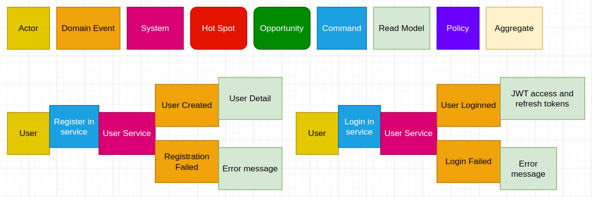

## Microservices for beginners

Microservices is the architecture style where an application builds from a set of autonomous services. Another type of application is monolith, monolith  contains all functionality in one service. But every service inside of a microservice application is monolith.

Many big applications began from monoliths, and this solution have advantages:
- Simple development and debug. We contain all our code in one service, it’s easy to launch and debug in IDE.
- Easy testing and monitoring. We can control the state of our application by one health check, all our logs saved in one place. It's easy to test one application without integrations and dependencies from other services.
- Data consistency. We use one database and will ensure consistency of our data by using database transactions.

But after few years of working and maintenance, monolith gets some disadvantages:
- Technology dependency. We start developing your application in a concrete language and framework, like php yii, so we will support the whole project lifetime of these technologies. And we will be looking for developers with these concrete skills.
- Understanding and maintenance. One e-commerce application contains a big codebase, which contains  customers, basket, orders, payments, cash receipts, sales, shippings. Tightly coupled code will be difficult for maintaining and understanding for new developers. After development several developers will have conflicts in changes of the same files.
- Scaling. After increasing traffic we will increase instances of the same application. We will have one database for application and we should increase the size of our storage and performance of our server.
- CI/CD pipelines. We will have several developers or several teams which develop one application. And changes of one feature will block deployment of another feature. Because of the big code base we will have a big count of tests and validations, pipelines will be long and heavy.

Modern fashion architecture style of distributed systems is microservices. It's became popular because of some advantages:
- Small size. Because of its small code base it’s easy to understand and develop. One developer may realize his service without knowledge of the whole project.
- Agility. Because our application contains small different services, we can deploy new features without blocking other services and teams.
- Scalability. After increasing traffic or data, we can increase instances of current service without affecting others.
- Reliability. Bug in one service will not affect others, and part of our application will still work.
- Different technologies. We can develop new services based on other languages or modern frameworks. Or we can employ developers for new services with knowledge of another language because our services communicate by http or message broker.

But distributed systems contain many disadvantages and challenges:
- Complexity. Every service will be easy, but understanding the whole application and coupling services between themselves will be difficult.
- Development and testing. Every small service requires data and communication from other services. Testing of applications requires knowledge of whole services and communications between them.
- Network. Every service will use others like monolith modules, but will use a network for every method usage.
- Data consistency. Every service has his own database. We will need to use several services for our business case and when one of them will not respond we will need to abort others. We will need to apply a difficult approach to consistency and distributed transactions instead of one database transaction.
- Different technologies. We can use different technologies, but it will be difficult to have  one developer for every technology or highly skilled developers for all of our languages and frameworks.

### Web message system

I want to create a message system, which events may happen there?

As a user I want to create my account in the system and login there. In the success case I want to see a success notification, in the error case I want to see an error message.

As a user I want to chat with another user. In the success case I will see our dialog, in the error case, I am not sure what should happen, error message or redirection. Should a system notify a second participant or not?

As a user I want to send a message into chat. In the success case I will see my message. System should send the message to the second participant. As a service owner I want to feel a friendly atmosphere. I want to avoid spam and toxic messages. Message service will send messages into AI services to analyze spam and toxicity.

From  these events I'm selecting several services:

- Front service - user interface web service.
- User service - service provides functionality for users in application.
- Message service - service provides functionality for conversation.
- Spam service - spam detection.
- Toxic service - toxic detection.
- API Gateway -  service provide single entry point for all clients.

Short description:

- User opens the front-end application in the browser.
- User wants to register a new account. Front-end service sends a http request to the api gateway. Api gateway sends a http request to the user service, and provides a response to the front-end service.
- User wants to login in the application. Front-end service sends a http request to the api gateway. Api gateway sends a http request with login and password to the user service. After successful response the api gateway generates two JWT tokens, first to verify the user and second for updating the main token every few minutes. After these actions the api gateway gives a response containing two tokens to the front-end service.
- User wants to see a list of other users. Front-end service sends a http request to the api gateway. Api gateway requests data from the user service, and provides a response to the front-end service.
- User opens the chat room for messaging. Front-end service emits an event to the api gateway through socket.io. Api gateway requests data from message service about a chat room, and data about users from the users service, and provides data to the front-end service.
- User sends a message, front-end service emits a message through socket.io. Api gateway emits messages in the Kafka topic for new messages.
- Message service subscribes to the topic with new messages, saves them and publishes events into the topic for saved messages.
- Users in the front-end service receive messages in the browser from the Api gateway.
- Spam service subscribes to the Kafka topic with saved messages. Scikit-learn
model analyzes messages. Messages which were predicted as spam do publish into the Kafka topic for analyzed messages.
- Toxic service subscribes to the Kafka topic with saved messages. Tensorflow model analyzes messages. Messages which were predicted as toxic do publish into the Kafka topic for analyzed messages.
- Message and User services listen to events with spam and toxic messages, mark them in the database, and apply domain logic after receiving these events.

Sources:

[Microsoft azure architecture guide](https://learn.microsoft.com/en-us/azure/architecture/guide/architecture-styles/microservices)

[System-design course](https://www.karanpratapsingh.com/courses/system-design/monoliths-microservices#microservices)

[Microservices architecture](https://www.youtube.com/watch?v=-XGTjzz7nEs&list=PLkQkbY7JNJuDqCFncFdTzGm6cRYCF-kZO&index=1)

[Event storming](https://www.ibm.com/cloud/architecture/architecture/practices/event-storming-methodology-architecture/)

[Event Storming - what it is and why you should use it with Domain-Driven Design](https://www.youtube.com/watch?v=7LFxWgfJEeI)
